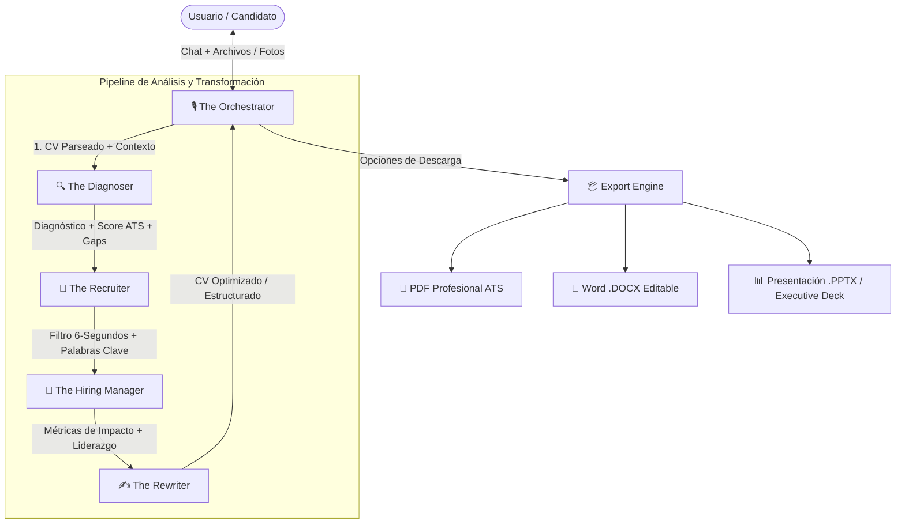

# 📄 Product Requirements Document (PRD)
## Multi-Agent AI Resume Studio & Career Architect

---

## 1. Visión del Producto
Una aplicación web interactiva, moderna y minimalista donde los usuarios interactúan con un **Agente Orquestador IA** en un chat conversacional fluido (estilo Antigravity / ChatGPT) para diagnosticar, optimizar, reescribir y generar currículums de impacto mundial.

El sistema ejecuta un flujo de trabajo orquestado a través de **4 Agentes Especializados de Élite**, permitiendo subir documentos existentes (PDF, Word) o fotos de perfil, y exportar el resultado final en formatos listos para postulación (**PDF, Word .docx y Presentación .pptx**).

---

## 2. Ecosistema de Agentes IA

### Roles y Responsabilidades de los 4 Agentes + Orquestador

1. **🎙️ The Orchestrator (El Anfitrión y Coordinador):**
   - Mantiene la conversación amigable, recopila expectativas de rol/salario, recibe archivos (PDF, Word, imágenes).
   - Comunica al usuario en tiempo real el progreso de los agentes mediante indicadores visuales interactivos.
   - Ofrece y despacha las descargas en los formatos elegidos.

2. **🔍 The Diagnoser (Diagnóstico y Análisis Profundo):**
   - *Motto: "Understand beyond the surface · Analyze, Diagnose, Solve"*
   - Evalúa estructura, detección de errores, vacíos temporales y calcula un puntaje de compatibilidad ATS (0-100%).

3. **🎯 The Recruiter (Perspectiva de Atracción y Talento):**
   - *Motto: "Find the right people. Build what matters · Find, Attract, Engage, Hire"*
   - Simula la prueba de los 6 segundos de un reclutador técnico/corporativo: evalúa escaneabilidad visual, keywords del sector y enganche inicial.

4. **💼 The Hiring Manager (Perspectiva de Dirección y Negocio):**
   - *Motto: "I hire people. I build legacy · Find leaders, Build teams, Drive impact, Deliver results"*
   - Valida el impacto cuantificable (fórmula XYZ: *Logré X medido por Y haciendo Z*), nivel de seniority, liderazgo y alineación con objetivos estratégicos.

5. **✍️ The Rewriter (Redacción Maestra y Elevación de Perfil):**
   - *Motto: "Stronger resumes. Better opportunities · Analyze, Rewrite, Optimize, Elevate"*
   - Reescribe cada sección con verbos de acción fuertes, elimina clichés, optimiza la tipografía y estructura el JSON final listo para maquetación.

---

## 3. Experiencia de Usuario (UI/UX - Estilo Minimalista Nuke API / Dark Bento)
- **Autenticación Limpia:** Acceso rápido mediante correo electrónico (Magic Link / OTP o credenciales seguras).
- **Interfaz de Chat Principal:**
  - Sidebar plegable con historial de currículums y sesiones anteriores.
  - Área central de conversación limpia con soporte para arrastrar y soltar (Drag & Drop) de archivos PDF, DOCX e imágenes JPG/PNG.
  - Indicador de estado de agentes en vivo ("The Diagnoser está analizando...", "The Rewriter está puliendo tus métricas...").
- **Panel de Previsualización en Vivo (Split-View Opcional):** Vista previa en tiempo real del CV a medida que se genera.
- **Centro de Descargas Multi-formato:**
  - 📄 **PDF** (Diseño moderno ATS-friendly, con o sin foto de perfil).
  - 📝 **Word (.docx)** (Formato 100% editable, tipografía limpia).
  - 📊 **PowerPoint (.pptx)** (Formato portfolio / deck ejecutivo de 1-2 diapositivas).

---

## 4. Stack Tecnológico Sugerido
- **Frontend & Backend:** Next.js 14+ (App Router), TypeScript, Tailwind CSS, Lucide Icons, Framer Motion.
- **Parser de Documentos:** `pdf-parse` / `mammoth` (para extraer texto limpio de PDF y Word).
- **Motores de Exportación:**
  - PDF: `@react-pdf/renderer` o Puppeteer/HTML-to-PDF de alta resolución.
  - Word: `docx` library (generación nativa de `.docx`).
  - PowerPoint: `pptxgenjs` (generación nativa de diapositivas ejecutivas).
- **Autenticación & DB:** NextAuth / Supabase Auth + JSON Store / SQLite local para persistencia de sesiones.
- **Modelos IA:** Integración multimodal (Claude 3.5 Sonnet / OpenAI / Gemini / OpenRouter) para procesamiento de texto e imágenes.
