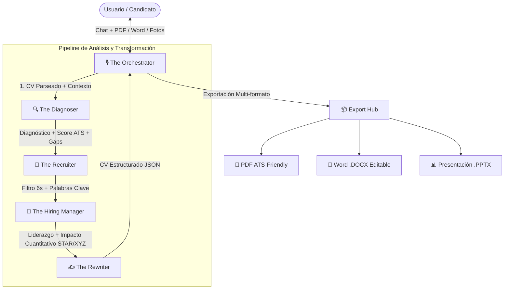

# 📄 Resume Studio · Multi-Agent AI Career Architect

> Aplicación web moderna y minimalista con arquitectura **4 Agentes Especializados de Élite + The Orchestrator** impulsada por **Google Gemini**, con soporte de subida de currículums (PDF/Word), fotos de perfil y exportación multi-formato (**PDF, Word .docx y PowerPoint .pptx**).

---

## 🤖 Panel de Agentes de Élite



### 1. 🎙️ The Orchestrator
Director Ejecutivo del estudio. Atiende al usuario en el chat conversacional, coordina la intervención de los 4 agentes y despacha las descargas de los archivos maquetados.

### 2. 🔍 The Diagnoser
*Motto: "Understand beyond the surface · Analyze, Diagnose, Solve"*
Audita la estructura del CV, detecta inconsistencias, vacíos de experiencia y calcula el puntaje de compatibilidad ATS (0-100%).

### 3. 🎯 The Recruiter
*Motto: "Find the right people. Build what matters · Find, Attract, Engage, Hire"*
Evalúa la escaneabilidad en los primeros 6 segundos y optimiza la densidad de palabras clave según el rol deseado.

### 4. 💼 The Hiring Manager
*Motto: "I hire people. I build legacy · Find leaders, Build teams, Drive impact, Deliver results"*
Transforma descripciones de tareas pasivas en logros de alto impacto cuantificable con la fórmula **Google XYZ** (*Logré X medido por Y haciendo Z*).

### 5. ✍️ The Rewriter
*Motto: "Stronger resumes. Better opportunities · Analyze, Rewrite, Optimize, Elevate"*
Redacta la versión ejecutiva final con copy persuasivo de alto nivel y genera la estructura JSON lista para maquetar.

---

## ✨ Características Principales

- **Chat Conversacional Fluido:** Interfaz interactiva estilo Antigravity / ChatGPT con soporte para Drag & Drop.
- **Ingesta Inteligente de Documentos:** Extracción instantánea de texto desde archivos **PDF** (`pdf-parse`) y **Word .docx** (`mammoth`), con soporte de fotos de perfil.
- **Vista Dividida en Vivo (Split-View):** Previsualización en tiempo real del currículum maquetado con medidor del Score ATS.
- **Exportación Multi-formato:**
  - 📄 **PDF:** Diseño moderno, limpio y 100% compatible con lectores ATS.
  - 📝 **Word (.docx):** Documento nativo 100% editable generado con `docx`.
  - 📊 **PowerPoint (.pptx):** Presentación ejecutiva / One-pager deck en 16:9 generado con `pptxgenjs`.
- **Autenticación con Google:** Integración directa con Supabase Auth y acceso por correo.
- **Configuración de Google Gemini:** Soporte para Gemini 2.0 Flash / 1.5 Pro mediante `.env.local` o configuración en vivo desde la interfaz.

---

## 🚀 Instalación y Puesta en Marcha

1. **Clonar el repositorio:**
   ```bash
   git clone https://github.com/neerworked-lab/curriculo.git
   cd curriculo
   ```

2. **Instalar dependencias:**
   ```bash
   npm install --legacy-peer-deps
   ```

3. **Configurar variables de entorno:**
   Copia el archivo `.env.example` a `.env.local` y define tus credenciales:
   ```bash
   cp .env.example .env.local
   ```
   ```env
   GEMINI_API_KEY=tu_clave_de_gemini
   NEXT_PUBLIC_SUPABASE_URL=tu_url_de_supabase
   NEXT_PUBLIC_SUPABASE_ANON_KEY=tu_anon_key_de_supabase
   ```

4. **Iniciar el servidor de desarrollo:**
   ```bash
   npm run dev
   ```
   Abre [http://localhost:3000](http://localhost:3000) en tu navegador.

---

## 🛠️ Stack Tecnológico

- **Framework:** Next.js 14+ (App Router)
- **Lenguaje:** TypeScript estricto
- **Estilos:** Tailwind CSS & Lucide Icons
- **IA Engine:** Google Gemini SDK (`@google/generative-ai`)
- **Parsers:** `pdf-parse`, `mammoth`
- **Exporters:** `docx`, `pptxgenjs`, `jspdf`
- **Auth:** Supabase Auth (Google OAuth)
